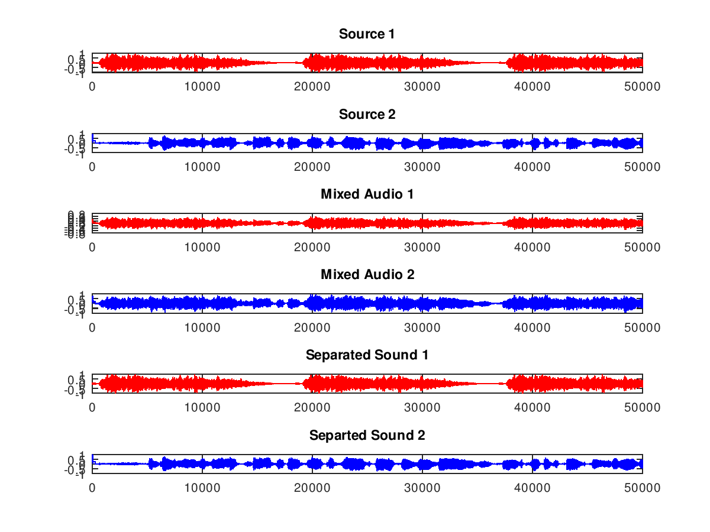

*ELL319 project: Audio Source Separation*

*Project by*
* Varun Desai, 2018EE10511
* Amenreet Singh Sodhi, 2018EE10440
* Sourav Kumar, 2018EE10504
* Akarsh Sharma, 2018EE10435

We have implemented the FastICA algorithm, which separates a set of mixed signals which are all linear combinations of some source signals, which are unknown to the algorithm. It tries to estimate the source signals by optimizing the demixing matrix of the mixed signals, the objective being maximizing the non-guassianity of the source signal. Hence, this algorithm won't work well for sources which are Guassian Distributed. Below is a figure which demonstrates the working of our algorithm. The mixing matrix was chosen randomly. 

The code was implemented in python first, and then in Octave, as a local installation of MATLAB was not available to us. Both the python and the octave implementation can be found in this repository.

`ica.m` has the implementation of the fastica algorithm.
`mainfile.m` loads the audio files, mixes them and then calls the ica function to separate them
`visualize.m` can be used to see the plots of the corresponding audio files. 
